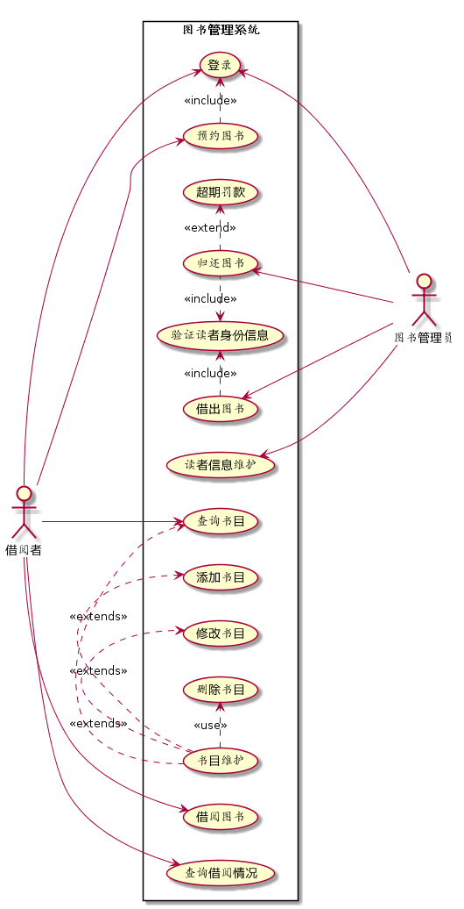

# 实验二：图书管理系统用例建模
|        学号      |     班级    |    姓名    |
|:----------------:|:-----------:|:----------:|
|   201510414310   |    软件(本)15-3 |    刘墙  | 
## 1.图书管理系统的用例关系图
### 1.1用例图PlantUML源码如下：
```
   @startuml
left to right direction
:图书管理员: as Admin
:借阅者: as User


rectangle 图书管理系统{

User --> (登录)
User --> (预约图书)
(预约图书).>(登录):<<include>>
User --> (借阅图书)
User --> (查询书目)
User --> (查询借阅情况)

(登录)<--- Admin
(借出图书) <-  Admin
(借出图书).>(验证读者身份信息):<<include>>
(验证读者身份信息)<.(归还图书):<<include>>
(归还图书).>(超期罚款):<<extend>>
(归还图书) <- Admin


(读者信息维护) <- Admin
(书目维护).>(查询书目):<<extends>>
(书目维护).>(添加书目):<<extends>>
(书目维护).>(修改书目):<<extends>>
(书目维护).>(删除书目):<<use>>
}
@enduml
```
### 1.2用例图如下：


## 2.参与者说明
### 2.1 图书管理员
主要职责是：借还书管理、读者信息管理以及还书逾期罚款等。
### 2.2 借阅者
主要职责是：可以通过查询图书、借取或者归还图书，也可查询自己的借阅情况。
## 3.用例的描述
### 3.1 "借出图书"用例
|     |     |
| :---: | :--- |
|用例名称|借出图书|  
|参与者|图书管理员（主要参与者）、借阅者（次要参与者）|
|前置条件|图书管理员已被识别和授权|
|后置条件|存储借书记录，更新库存数据，所借图书状态为借出|
|主事件流|1.图书管理员将读者借书卡提供给系统；<br>2.系统验证读者身份和借书条件；<br>3.图书管理员将读者所借图书输入系统；<br>4.系统记录借书信息，并且修改图书的状态和此书的可借数量；<br>5系统累加读者的借书数量；<br>6.重复3~5，直到图书管理员确认全部图书登记完毕；<br>7.系统打印借书清单，交易成功完成|
 ### 3.2 "归还图书"用例
|     |     |
| :---: | :--- |
 |用例名称|归还图书|  
 |参与者|图书管理员（主要参与者）、借阅者（次要参与者）|
 |前置条件|图书管理员已被识别和授权|
 |后置条件|存储还书记录，更新库存数据，所借图书状态为未借出|
 |主事件流|1.图书管理员将读者借书卡提供给系统；<br>2.系统验证读者身份和还书条件；<br>3.图书管理员将读者所借图书输入系统；<br>4.由系统计算出图书所借日期是否逾期，若逾期则需要借阅者缴纳逾期罚款 <br>5.系统记录还书信息，并且修改图书的状态和此书的可借数量；<br>6.系统打印还书清单，交易成功完成|
 |备注|无|
 ### 3.3 查询借阅情况
|     |     |
| :---: | :--- |
 |用例名称|查询借阅情况|
 |参与者|借阅者|  
 |前置条件|图书馆的主页面正常运行，网络通信良好|  
 |后置条件|如果读者信息无误，则查询成功，否则失败。|
 |主事件流| 1.读者在图书管理系统上进行查询；2.系统管理员对读者的个人信息进行查询；3.读者向系统管理员提出申请未通过；4.用户重新提出申请；5.系统管理员重新审核。| 
 |备注|无|
 ### 3.4 查询图书信息
  |     |     |
  | :---: | :--- |
  |用例名称|查询图书信息|
  |参与者|借阅者（主要参与者），图书管理员（主要参与者）|  
  |前置条件|借阅者已经打开图书馆系统的页面，并登录，进入查询书库界面 | 
  |后置条件|页面将返回到学院图书馆系统主页面 |
  |主事件流|  1.借书者、图书管理员打开图书馆系统的页面；<br>2.借书者、图书管理员进入查询书库页面；<br> 3. 借书者、图书管理员入要查询的书名/编者/版本/分类...；<br>4. 借书者、图书管理员、系统管理点击确定查找；<br> 5. 系统开始搜索相关的图书，若有则显示所有相关图书的条目，若无则 提示“非常抱歉，暂时没有此书目”| 
  |备注|无|
  
### 3.5 预订图书
  |     |     |
  | :---: | :--- |
  |用例名称| 预约图书 | 
  |参与者| 借书者（主要参与者）、图书管理员（次要参与者）|  
  |前置条件| 借书者已经打开图书馆系统的页面，并登录，进入图书预定界面| 
  |后置条件|  页面将返回到学院图书馆系统主页面|
  |主事件流|  1. 借书者、图书管理员打开学院图书馆系统的页面； <br>2. 借书者、图书管理员进入图书预定页面；  <br>3. 借书者、输入要预定的书名/编者/版本...；<br> 4. 借书者、点击确定查找；<br>  5. 借书者、在结果中选择需要预定的图书进行预定；<br> 6. 双击选择要预定的图书，确认提交预定|  
 | 备注|  无|

### 3.6 超期罚款
  |     |     |
  | :---: | :--- |
  |用例名称|超期罚款|
  |参与者| 借书者、图书管理员| 
  |前置条件| 图书管理员登录系统 |
  |后置条件| 系统更新图书信息| 
  |主事件流|  1. 管理员进入学院图书馆系统； <br>2. 管理员打开借还书页面； <br>3. 管理员扫描图书读入图书信息； <br>4. 管理员扫描食堂卡读入读者信息；  <br>5. 管理员点击还书按钮，在弹出的确认窗口点击确认按钮；<br> 6. 系统检测读者信息图书信息，确认是否可以进行还书操作； <br> 7. 系统进行超期罚款操作； <br> 8. 系统进行还书操作，更改数据库； <br>9. 提示还书成功。|
  |备注|无|