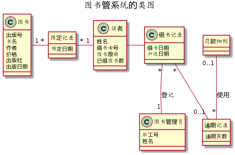
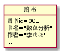
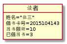
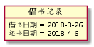

# 实验3：图书管理系统领域对象建模
|学号|班级|姓名|
|:-------:|:-------------: | :----------:|
|201510414310|软件(本)15-3|刘墙|

## 1：图书管理系统的类图

### 1.1类图PlantUML源代码：
```
@startuml
title 图书管系统的类图

Class 图书{
出版号
书名
作者
价格
出版社
出版日期
}

Class 预定记录{
预定日期
}
hide 预定记录 Circle


Class 借书记录{
借书日期
归还日期
}

Class 读者{
姓名
借书卡号
图书限额
已借图书数
}

Class 图书管理员{
职工号
姓名
}

Class 逾期记录{
逾期天数
}
hide 逾期记录 Circle

Class 罚款细则
hide 罚款细则 Circle

图书 "1" - "*" 预定记录
预定记录 "*" - "1" 读者
读者 - 借书记录
借书记录 "*" -- "1" 图书管理员:登记
借书记录 "*" -- "0..1" 逾期记录
罚款细则 "0..1" -- "*" 逾期记录:使用
@enduml
```
### 1.2类图如下所示：

### 1.3类图说明：
类图具体涉及图书、图书管理员、读者、借阅记录四大类，基本覆盖图书管理系统的主要类。
## 2图书管理系统的对象图
### 2.1类图书的对象图：
#### 源码如下所示：
```
object 图书{
图书id=001
书名="数值分析"
作者="李庆扬"
...
}
```
#### 对象图如下所示：

### 2.2类读者的对象图：
#### 源码如下所示：
```
object 读者{
姓名="张三"
借书卡号=2015104143
图书限额=10
已借图书=3
}

```
#### 对象图如下所示：

### 2.3类图书管理员的对象图：
#### 源码如下所示：
```
object 图书管理员{
职工号="cdu001"
姓名="张雪峰"
}
```
#### 对象图如下所示：

### 2.4类借书记录的对象图：
#### 源码如下所示：
```
object 借书记录 {
  借书日期 = 2018-3-26
  还书日期 = 2018-4-6
}
```
#### 对象图如下所示：

