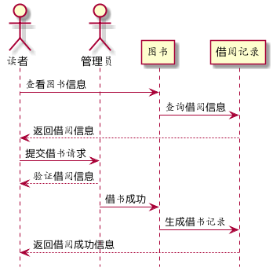
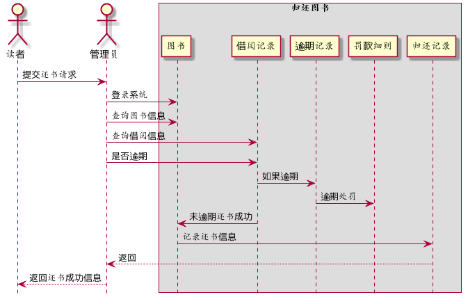
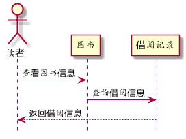
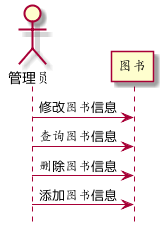
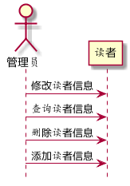

# 实验4：图书管理系统顺序图绘制
|学号|班级|姓名|
|:-------:|:-------------: | :----------:|
|201510414310|软件(本)15-3|刘墙|

## 图书管理系统的顺序图

## 1. 借书用例
### 1.1. 借书用例PlantUML源码

```
@startuml
hide footbox
actor 读者
actor 管理员
读者 -> 图书:查看图书信息
图书 -> 借阅记录:查询借阅信息
借阅记录 --> 读者:返回借阅信息
读者 -> 管理员:提交借书请求
管理员-->读者:验证借阅信息
管理员->图书:借书成功
图书->借阅记录:生成借书记录
借阅记录-->读者:返回借阅成功信息
@enduml
```

### 1.2. 借书用例顺序图


### 1.3. 借书用例顺序图说明
读者需通过管理员才能借书，不能够越过权限，这种方式方便管理员管理图书。

***

## 2. 还书用例
### 2.1. 还书用例PlantUML源码

``` 
@startuml
hide footbox
actor 读者
actor 管理员
读者 -> 管理员 :提交还书请求
box "归还图书"
管理员 -> 图书 :登录系统
管理员 -> 图书 :查询图书信息
管理员 -> 借阅记录 :查询借阅信息
管理员 -> 借阅记录 :是否逾期
借阅记录 -> 逾期记录 :如果逾期
逾期记录 ->罚款细则:逾期处罚
借阅记录->图书 :未逾期还书成功
图书 -> 归还记录:记录还书信息
end box
管理员 <-- 归还记录 :返回
读者 <-- 管理员 :返回还书成功信息
@enduml
```

### 2.2. 还书用例顺序图


### 2.3. 还书用例顺序图说明
还书由读者发出，由管理员完成。
***
## 3. 查询图书用例
### 3.1.查询图书用例PlantUML源码
```
@startuml
hide footbox
actor 读者

读者 -> 图书:查看图书信息
图书 -> 借阅记录:查询借阅信息
借阅记录 --> 读者:返回借阅信息
@enduml
```
### 3.2. 查询图书用例顺序图

***
## 4. 维护图书用例
### 4.1.维护图书用例PlantUML源码
```
@startuml
hide footbox
actor 管理员

管理员 -> 图书:修改图书信息
管理员 -> 图书:查询图书信息
管理员 -> 图书:删除图书信息
管理员 -> 图书:添加图书信息
@enduml
```
### 4.2. 维护图书用例顺序图

***
## 5. 管理用户用例
### 5.1.管理用户用例PlantUML源码
```
@startuml
hide footbox
actor 管理员

管理员 -> 读者:修改读者信息
管理员 -> 读者:查询读者信息
管理员 -> 读者:删除读者信息
管理员 -> 读者:添加读者信息
@enduml
```
### 5.2. 管理用户用例顺序图
