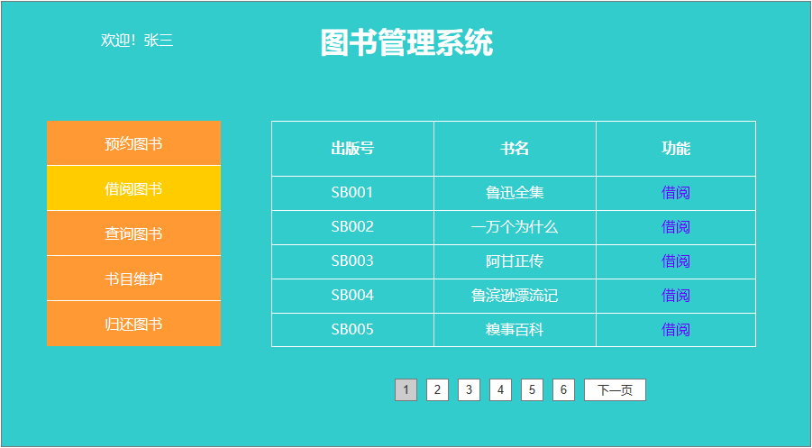

# 实验五：图书管理系统数据库设计与界面设计
|        学号      |     班级    |    姓名    |
|:----------------:|:-----------:|:----------:|
|   201510414310   |    软工(本)15-3 |   刘墙  | 

## 1 数据库表设计
### 1.1 图书类
|字段|类型|主键，外键|可以为空|说明|
|:-:|:-:|:-:|:-:|:-:|
|国际出版号|bigint|主键|否|图书的唯一标识|
|书名|varchar(64)||否|图书的名称|
|作者|varchar(32)||否|图书的作者|
|简介|varchar(256)||是|图书的大致介绍，可以让读者更了解图书|
|可借数量|int||否|图书的还可以借出的数量|
|价格|float||否|图书的价格信息|
|出版社|varchar(64)||否|图书的出版社信息|
|出版日期|date||否|图书的出版日期|

### 1.2 图书管理员类
|字段|类型|主键，外键|可以为空|说明|
|:-:|:-:|:-:|:-:|:-:|
|职工号|bigint|主键|否|图书管理员的职工编号|
|姓名|varchar(64)||否|图书管理员的职工姓名|

### 1.3 读者类
|字段|类型|主键，外键|可以为空|默认值|说明|
|:-:|:-:|:-:|:-:|:-:|:-:|
|姓名|varchar(32)||否||读者姓名|
|性别|varchar(2)||否||读者性别|
|借书限额|int||否|10|读者的可借图书的限定|
|已借图书|int||否|0|读者性别|
|借书号|bigint|主键|否||读者的借书号|

### 1.4 借书记录类
|字段|类型|主键，外键|可以为空|说明|
|:-:|:-:|:-:|:-:|:-:|
|借书号|bigint|主键|否|读者的借书号|
|图书书名|varchar(64)||否|图书的书籍姓名|
|借书日期|date||否|借书日期记录|
|归还日期|date||否|归还日期记录|

### 1.5 逾期记录
|字段|类型|主键，外键|可以为空|说明|
|:-:|:-:|:-:|:-:|:-:|
|借书卡号|bigint|主键|否|读者的借书卡的卡号|
|逾期天数|int||否|读者逾期的天数|
|处罚金额|float||否|读者逾期处罚的金额|
|状态|bit||否|读者逾期处罚的状态|

### 1.6 预定图书记录
|字段|类型|主键，外键|可以为空|说明|
|:-:|:-:|:-:|:-:|:-:|
|借书卡号|bigint|主键|否|读者的借书卡的卡号|
|预定图书名称|varchar(64)||否|读者预定书籍的名称|
|预定日期|date||否|读者预定书籍的日期|
|状态|bit||否|读者预定书籍的状态|

## 2.界面设计

### 2.1 还书界面
#### 2.1 借书界面设计

* 用例图参见：借书用例
* 类图参见：借书类
* 顺序图参见：借书顺序图
* API接口如下：

##### 1.获取图书信息
* 功能：获取图书信息
* 请求地址：http://bookManage.lq.cn/api/borrow
* 请求方法：POST
* 请求参数：

|        参数名称      |     必填    |    说明    |
|:----------------:|:-----------:|:----------:|
|   userInfo   |    是   |    用于验证请求合法性的认证信息  | 
|   method         |    是  |     固定为“POST” |
|   key      |    是|      图书信息的关键字|
* 返回实例

        {
            "info": "success",
            "data": {
                "title":"鲁滨逊漂流记",
                "isbn":"978-7-500-765868-1",
                "publisher":"新华图书出版社",
                "price":"58.50",
                "cap":"188",
				},
            "code": 200
        }
    
|  参数名称   |   说明   |
|:---:|:----:|
|  info   |  返回信息    |
|  data  |   返回的图书详细信息|
|  code |    返回码 |
