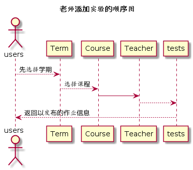

# “添加实验”用例 [返回](../README.md)
## 1. 用例规约

|用例名称|添加实验|
|-------|:-------------|
|功能|教师发布新的实验|
|参与者|老师|
|前置条件|教师必须先登录|
|后置条件|发布成功提示|
|主流事件| |
|备注| |

## 2. 业务流程 [源码](../src/setWorks.puml)
 

## 3. 界面设计
- 界面参照: https://somono.github.io/is_analysis/test6/ui/putworks.html
- API接口调用
    - 接口1：[setWorks](../api/setWorks.md)

## 4. 算法描述
无
    
## 5. 参照表
- [TESTS](../数据库设计.md/#TESTS)
- [CLASSES](../数据库设计.md/#CLASSES)
