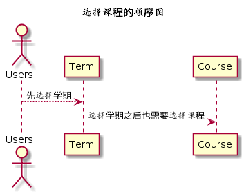

# “选择课程”用例 [返回](../README.md)
## 1. 用例规约

|用例名称|选择课程|
|-------|:-------------|
|功能|用户登录之后需要确定操作的课程名称|
|参与者|学生，老师|
|前置条件|学生，老师需要先登录且已选择学期|
|后置条件| |
|主流事件| |
|备注| |

## 2. 业务流程（顺序图） [源码](../src/chooseCourse.puml)
 

## 3. 界面设计
- 界面参照: https://somono.github.io/is_analysis/test6/ui/chooseterm.html
- API接口
    - 接口1：[getUserCourse](../api/getUserCourses.md) 

## 4. 算法描述（活动图）

- 学生用户CHOOSE_COURSE(老师用户TEACH_COURSE)解析为卡片块。
  - CHOOSE_COURSE为唯一返回值，返回值为数组，数组元素为课程名称，前台直接根据元素进行UI显示。

## 5. 参照表

- [STUDENTS](../数据库设计.md/#STUDENTS)
- [TEACHERS](../数据库设计.md/#TEACHERS)
- [COURSE](../数据库设计.md/#COURSE)
