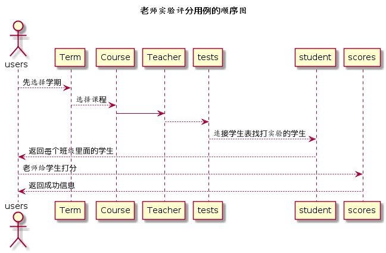

# “实验打分”用例 [返回](../README.md)
## 1. 用例规约

|用例名称|实验打分用例|
|-------|:-------------|
|功能|老师添加实验的各个得分项，并为每个学生作业打分|
|参与者|老师|
|前置条件|需要登录进入主页，并选择发布的作业题目|
|后置条件| |
|主流事件| |
|备注| |

## 2. 业务流程（顺序图） [源码](../src/markWork.puml)
 

## 3. 界面设计
界面参照: https://somono.github.io/is_analysis/test6/ui/markworks.html

- API接口
    - 接口1：[markWork](../api/markWork.md)

        用于设置一个学生的部分实验成绩和评语

    - 接口2：[getNextPrevStudent](../api/getNextPrevStudent.md)
        
        根据课程号取得上一个或者下一个学生的学号
        

## 4. 算法描述（活动图）

无

## 5. 参照表

- [STUDENTS](../数据库设计.md/#STUDENTS)
- [GRADES](../数据库设计.md/#GRADES)
- [TESTS](../数据库设计.md/#TESTS)
