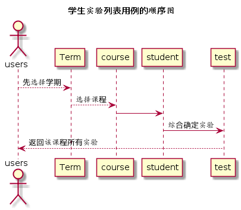

# 学生实验列表用例 [返回](../README.md)
## 1. 用例规约

|用例名称|学生实验列表|
|-------|:-------------|
|功能|以表形式的显示出该学生在该学期该课程的实验|
|参与者|学生|
|前置条件|学生需要先选择学期和课程|
|后置条件| |
|主流事件| |
|备注| |

## 2. 业务流程（顺序图） [源码](../src/stuWorkList.puml)
 

## 3. 界面设计
界面参照: https://somono.github.io/is_analysis/test6/ui/stuworksscore.html
- API接口
    - 接口1：[getStudentWorks](../api/getStudentWorks.md)

## 4. 算法描述（活动图）

- workList解析为列表  
  - workList作为接口getStudentsWorks的返回值，该值是一个对象，对象中包含数条数组数据。数组的第一个值为实验编号，第二个值实验名称，
  第三个值为该作业题目的得分Id，第四值为该实验得分。数据依次在列表中显示，得分Id隐藏显示，得分为null则不显示。前台在表格的最后一行计算出每次作业的平均得分。
## 5. 参照表

- [STUDENTS](../数据库设计.md/#STUDENTS)
- [COURSE](../数据库设计.md/#COURSE)
- [TERM](../数据库设计.md/#TERM)
- [TESTS](../数据库设计.md/#TESTS)
- [SCORE](../数据库设计.md/#SCORE)
