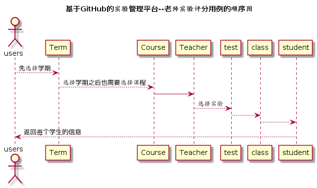

# "学生列表"用例 [返回](../README.md)

## 1. 用例规约

|用例名称|学生列表|
|-------|:-------------|
|功能|以列表形式的显示出所有学生的信息|
|参与者|老师|
|前置条件|老师需要先选择课程和实验|
|后置条件| |
|主流事件| |
|备注| |

## 2. 业务流程（顺序图） [源码](../src/studentList.puml)
 

## 3. 界面设计
界面参照: https://somono.github.io/is_analysis/test6/ui/studentlist.html
- API接口
    - 接口1：[getStudentList](../api/getStudentList.md)

## 4. 算法描述（活动图）

- studentList解析为列表  
  - studentList作为接口getStudentsList的返回值，该值是一个对象，对象中包含数条数组数据。数组的第一个值为学号，第二个值为姓名，第三个值为学生的Github用户名。
## 5. 参照表

- [STUDENTS](../数据库设计.md/#STUDENTS)
- [TEACHERS](../数据库设计.md/#TEACHERS)
- [TERM](../数据库设计.md/#TERM)
- [TESTS](../数据库设计.md/#TESTS)
