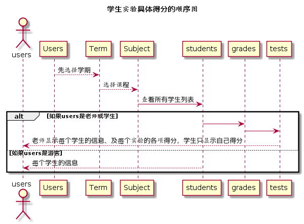

# “查看各项成绩”用例 [返回](../README.md)
## 1. 用例规约

|用例名称|查看各项成绩|
|-------|:-------------|
|功能|学生、老师能查看到每次实验的具体成绩及各个得分项|
|参与者|学生、老师|
|前置条件|已选择学期及课程，且进入到具体的某个用户|
|后置条件| |
|主流事件| |
|备注| |

## 2. 业务流程（顺序图） [源码](../src/workdtlScore.puml)
 

## 3. 界面设计
界面参照: https://somono.github.io/is_analysis/test6/ui/workdtlscores.html
- API接口
    - 接口1：[getSpecificGrades](../api/getSpecificGrades.md)

## 4. 算法描述（活动图）

- RESULT_SPECIFIC解析为列表。
  - RESULT_SPECIFIC为接口getSpecificGrades的返回值，返回值为数组，数组元素为单项成绩打分要求与具体得分，前台直接根据列表显示数据，在列表之后显示作业评价。

## 5. 参照表

- [STUDENTS](../数据库设计.md/#STUDENTS)
- [COURSE](../数据库设计.md/#COURSE)
- [TERM](../数据库设计.md/#TERM)
- [TESTS](../数据库设计.md/#TESTS)
- [SCORE](../数据库设计.md/#SCORE)

